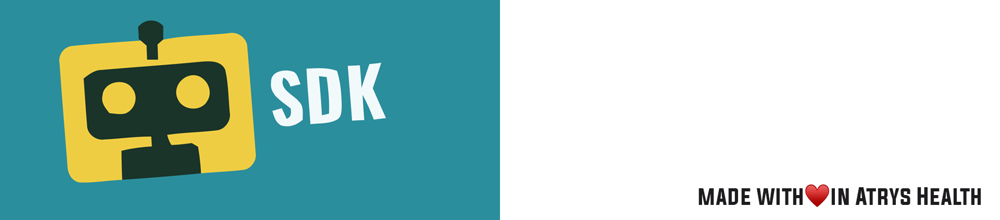

# Atrys SDK for integrations

## Purpose

---

The purpose of this project is to deliver a tool to consume the resources present in the Atrys teleconsultation platform, exposing a series of methods to perform the necessary requests to backend.

## Patient model

---

At the moment of making an integration with the teleconsultation platform, the patient model with which you work must be clearly exposed, so that our rules engine can "translate" your model to ours, this process is one of the initial ones at the beginning of the commercial/technical relationship.

## API REST Docs

---

In case you want to consume the API REST solution here you can consult the [MIT API REST technical specification here](./mit-sdk-api-spec.md).

## Patient model

---

At the moment of making an integration with the teleconsultation platform, the patient model with which you work must be clearly exposed, so that our rules engine can "translate" your model into Atrys patient model, this process is one of the initial ones at the beginning of the commercial/technical relationship.

#### Current Model

```
const identificationDataSchema = new Schema({
  passport: { type: String, required: false },
  run: { type: String, required: false },
  isForeign: { type: String, required: false },
  cbo: { type: String, required: false },
  cboDesc: { type: String, required: false },
  ctps: { type: String, required: false },
  cpf: { type: String, required: false },
  cns: { type: String, required: false },
  rg: { type: String, required: false },
  ce: { type: String, required: false },
  cd: { type: String, required: false },
  pa: { type: String, required: false },
  sc: { type: String, required: false },
  pe: { type: String, required: false },
  rc: { type: String, required: false },
  ti: { type: String, required: false },
  cn: { type: String, required: false },
  as: { type: String, required: false },
  ms: { type: String, required: false },
  dni: { type: String, required: false },
  nie: { type: String, required: false },
  idDocumentNumber: { type: String, required: false },
  pasep: { type: String, required: false },
  professionalUfNumber: { type: String, required: false },
  titleVote: { type: String, required: false },
  issuingBody: { type: String, required: false },
  nrConvenio: { type: String, required: false },
  rgRegistry: { type: String, required: false },
},
  {
    strict: true
  }
)

const addresDataSchema = new Schema({
  uf: { type: String, required: false },
  city: { type: String, required: false },
  zipcode: { type: String, required: false },
  street: { type: String, required: false },
  streetNumber: { type: String, required: false },
  complement: { type: String, required: false },
  cep: { type: String, required: false },
  neighborhood: { type: String, required: false },
},
  {
    strict: true
  }
)

const personalDataSchema = new Schema({
  name: { type: String, required: false },
  lastName: { type: String, required: false },
  middleName: { type: String, required: false },
  motherName: { type: String, required: false },
  secondLastName: { type: String, required: false },
  gender: { type: String, required: false },
  phoneNumber: { type: String, required: false },
  email: { type: String, required: false },
  birthdate: { type: String, required: false },
  healthInsurance: { type: String, required: false },
  nacionality: { type: String, required: false },
  education: { type: String, required: false },
  familySituation: { type: String, required: false },
  inmigrationDate: { type: String, required: false },
  isSchool: { type: Boolean, required: false },
  regimen: { type: String, required: false },
  isTutor: { type: Boolean, required: false },
  ufBirth: { type: Boolean, required: false },
  municipalityBirth: { type: Boolean, required: false },
  originCountry: { type: Boolean, required: false },
  tutorNationalId: { type: Boolean, required: false },
},
  {
    strict: true
  }
)

const patientSchema = new Schema(
  {
    identificationData: { type: identificationDataSchema, required: false },
    personalData: { type: personalDataSchema, required: true },
    addressData: { type: addresDataSchema, required: false },
    userId: { type: mongoose.Types.ObjectId, ref: 'User', unique: true },
    medicalRecordId: {
      type: mongoose.Types.ObjectId,
      ref: 'MedicalRecord',
      unique: true,
    },
    isBulkPatient: { type: Boolean, required: false }
  },
  {
    timestamps: true,
    strict: true
  }
);
```

## Javascript Browser CDN

This SDK has been published in the following link so that it is available for use (javascript in browser)

```
https://cdn.mit.telemedicina.com/atrys-sdk.js
```


## NPM Module

The npm site of the module can be found [here](https://www.npmjs.com/package/@atrysglobal/integrations-sdk)

```
npm i @atrysglobal/integrations-sdk
```

## SDK Modes
Our SDL has 2 workng modes:

* SDK_ADMIN: Used in operations like, Patient CRUD and Availability CRUD
* SDK_PATIENT: Used in operations that require main target in patient, like Appointment and SSOLink

## MIT.Configuration

 * stage (String) - This is the stage of the application. It can be either "DEV", "STAGING" or "PROD".
 * setup (String) - This is the setup that you want to use. Only for custom behaviour, logic or costumer custom environment (e.g: CO, ES, CL, BR)
 * clinicId (String) - The clinic ID of the clinic you want to use.
 * locale (String) - This is the language expected to be returned, 'es_ES', 'es_CL', es_CO', 'pr_BR'
 * mode (String) - This is the mode of the application. It can be either 'dev' or 'prod'.


For integration yo need to replace the PROD string for STAGING

## MIT.Credentials
* publicKey (String) - Key pair given by AtrysHealth at the moment of integration. Used to authenticate the request of the current client.

## SharedData

This class is a singleton to set and get information necessary for the use of both private and public internal methods.

the public properties are:

```
public environment: Environment = {
	frontend: string,
	backend: string,
};

public tokens: SessionTokens = {
	mit: string,
	atrysBackend: string,
	atrysFrontEnd: string,
};

public patientId: string;
public patientUsername: string;
public patientPassword: string;
public appopintmentReservedId: string;
public mode: string;
public mode: publicKey;
public integrationClientIdentificator: string;
public integrationExternalId: string;
public setup: string = '';
public stage: string = '';
public errors: IErrors[] = [];
public clinicId: string = '';
public loginToken: string = '';
```

>**@patientId:** String patient id, this will be used when access is granted at login and the value will be set to sharedData.patientId. 
>
>**@patientUsername:** String patient's username, the value will be stored in the variable sharedData.patientUsername when the model is normalized and will also be used to generate the magic link.
>
>**@patientPassword:** String patient's password, the value will be stored when normalizing the model in the variable sharedData.patientPassword and will be used during login.
>
>**@appopinmentReservedId:** String Id of the reserved schedule, which will be stored in sharedData.appopintmentReservedId and will be used when the appointment is consolidated.
>
>**@mode:** String integration mode. The value is defined in the constructor in the variable sharedData.mode, currently only SDK_PATIENT is enabled.
>
>**@publicKey:** String public access key, which is defined in the constructor in the variable sharedData.publicKey and this is used when a request is made to obtain the session token.
>
>**@integrationClientIdentificator:** String Unique identificator for integrated client, must be used in the payload.source when normelize patient endpoint is called.
>
>**@environment:** Instance of Environmentss where the frontend and backend endpoints will be stored.
>
>**@tokens:** Tokens instance that will be used to store the necessary tokens for the use of different methods.
>
>**@errors:** Array of runtime errors catched by the SDK
>
>**@ stage:** String of the desired stage to be consumed, current posibilities are: DEV, STAGING and PROD
>
>**@ setup:** String of the deseired setup to be performed in backend behaviour, current posibilities are mentioned in Environment Setups below.
>
>**@ clinicId:** String given by AtrysHealth at the moment of integration, its UUID of the clinic to be used in the SDK operations.
>
>**@ loginToken:** String of backend token to authenticate request operations.


# API

These are all exposed public methods

```
MitInterface {
  availability: {
    create: (availability: IAvailability, professionalId: string) => Promise<any>;
    update: (availability: IAvailability, availabilityId: string, professionalId: string) => Promise<any>;
    list: (professionalId: string) => Promise<any>;
    objetives: () => Promise<any>;
    enable: (availabilityId: string) => Promise<any>;
    disable: (availabilityId: string) => Promise<any>;
  };
  appointment: {
    reserve: (appointmentType: AppointmentType, dateDetails: any, patientDetails: any) => Promise<any>;
    consolidate: (symptoms: string[]) => Promise<any>;
    symptoms: () => Promise<any>;
    byExternalId: () => Promise<any>;
  };
  common: {
    session: () => Promise<SessionInterface>;
    normalize: (clientPatientModel: any) => Promise<any>;
    ssoLink: () => string;
  };
  patient: {
    create: (clientPatientModel: any) => Promise<any>;
    login: () => Promise<any>;
    resetCredentials: (patientModel: any) => Promise<any>
    update: (patientModel: any, userId: string) => Promise<any>
  };
  specialty: {
    list: () => Promise<any>;
    byId: (specialtyId: string) => Promise<any>;
  };
  professionals: {
    bySpecialtyId: (specialtyId: string) => Promise<any>;
    blocks: (queryBlock: any) => Promise<any>;
    list: () => Promise<any>;
  }
}

```

## Payloads

#### Availability
```
{
"administrativeDetails":{
    "objective": "6213e19cc2a6c02a6ac79328",
    "appointmentDuration": 10
},
"professionalDetails": {
    "specialtyId": "6213e196c2a6c02a6ac792b1"
},
"dateDetails": {
    "startDate": {
        "year": 2022,
        "month": 9,
        "day": 20
    },
    "endDate": {
        "year": 2022,
        "month": 11,
        "day": 30
    },
    "days": ["sabado", "domingo"],
    "dailyRanges": [{ "start": "17:00", "end": "19:00" }]
}
```

## Appointment
#### Date Details
```
{
    date: {
        month: 9,
        year: 2022,
        day: 21
    },
    start: "09:00"
}
```

#### Professional Details
```
{
    specialtyId: "6213e196c2a6c02a6ac792b1",
    userId: "6217765f76f0e0556808c454"
}
```


```
common.session(): Promise<SessionInterface>;
```
> Create a new session in our session service ang get a MIT Token
>
>

```
normalizeModel(clientPatientModel: any): Promise<any>;
```

> Method for normalize the patient model for work with Atrys Backend
>
> **@clientPatientModel**: Object with the patient data

## Client Integration Model
Note: The previously set integrationClientIdentificator variable must be used here.

```
    const clientPatientModel = {
        "from": integrationClientIdentificator,
        "payload": { ...the model patient used internally }
    }

```

Here is an **example** of a payload model for integration:

```
{
    "GeolocationData": {
        "Country": "AR",
        "State": "Buenos Aires",
        "City": "DHJ",
        "Latitude": "-34.5618913",
        "Longitude": "-58.4617484",
        "Address": "Test 123",
        "Extra": ""
    },
    "BeneficiaryData": {
        "IdType": "DNI",
        "IdNumber": "34567899",
        "FirstName": "Test Test",
        "LastName": "Test Test",
        "IntPhoneCode": "54",
        "PhoneNumber": "12345678",
        "Email": "a@b.com",
        "DateOfBirth": "2001-01-01",
        "Language": "ES"
    },
    "CaseData": {
        "CaseId": "637741353756375358",
        "CaseNum": "637741353756375358"
    }
}
```

**Atrys Normalized Patient Model (normalizedPatientModel).**
Example: 

```
const normalizedPatientModel = await mit.normalizeModel(clientPatientModel)
```

The service returns internal model parsed for ready to use in Atrys backends.

```
{
    "clinicId": string",
    "identificationData": {
        "isForeign": boolean,
        "passport": string,
        "dni": string
    },
    "personalData": {
        "name": string,
        "lastName": string,
        "secondLastName": string,
        "phoneNumber": string,
        "email": string,
        "breed": string,
        "gender": string,
        "birthdate": string,
        "nacionality": string,
        "healthInsurance": string,
    },
    "addressData": {
        "uf": string,
        "city": string,
        "neighborhood": string,
        "street": string,
        "complement": string,
        "streetNumber": string,
        "zipcode": string,
    },
    "password": string,
    "externalId": string,
    "gender":string
}
```

```
patient.create(normalizedPatientModel: any): Promise<any>;
```

> Method for create a new patient in the Atrys Backend.
>
> **@normalizedPatientModel**: Object with the patient data model normalized by our RuleEngine. Normalized model must look like Atrys patient model exposed below.

```
patient.login(): Promise<any>;
```

> Login method for authenticate the user in Atrys Backend

```
professionals.list(): Promise<any>;
```

> List all professional present in the selected backend by setup variable in session method.

```
specialty.byId(specialtyId: string): Promise<any>;
```

> Method for list the specialties derived by a main specialty id. Ex: In medicine have general, family, cardiology, etc
>
> **@specialtyId**: id of the main medical specialty

```
professionals.blocks(queryBlock: any): Promise<any>;
```

> Method for list all available blocks for the selected professional.
>
> **@queryBlock**:

```
{
	"date" {
		"month":8,
		"year":2021,
		"day":25
		},
	"specialtyId":"611d8635f2fbbcfe08c8f5b0"
}
```

### Appointment Type Enum

```
export enum AppointmentType {
    SCHEDULED,
    IMMEDIATE
}
```

#### Inmediate Appointment Reserve

>**@type**: String value 'IMMEDIATE'

```
appointment.reserve(appointmentType: AppointmentType): Promise<any>;
```

> Method for reserve a new scheduled appointment.
>
> **@reservePayload**:

```
{
    "appointmentType": "IMMEDIATE"
}
```


#### Scheduled Appointment Reserve

**@type**: String value 'SCHEDULED'
**@dateDetails**: String value 'SCHEDULED'
**@patientDetails**: String value 'SCHEDULED'

```
appointment.reserve(appointmentType: AppointmentType, dateDetails: any = {}, patientDetails: any = {}): Promise<any>;
```

> Method for reserve a new scheduled appointment.
> 
>**@reservePayload**:

```
{
    "professionalDetails": {
        "specialtyId": "6213e196c2a6c02a6ac792b1",
        "userId": "6217765f76f0e0556808c454"
    },
    "dateDetails": {
        "date": {
            "year": 2022,
            "month": 8,
            "day": 10
        },
        "start": "15:50"
    },
    "appointmentType": "SCHEDULED"
}
```

```
appointment.consolidate(symptoms: string[]): Promise<any>;
```

> Method for consolidate previous reserved appointment.
>
> **@symptoms**: array of symptoms

```
common.ssoLink(): string;
```

> Method for create the magic link for deliver to clients for passwordless login acces to Atrys platform.


```
appointment.byExternalId(): Promise<any>;
```

> Method that gets the id of an appointment by the external id of the patient. (or get appointment id by external integration id)


### Javscript Basic Example
#### Inmediate medical apppointment.

One of the necessary variables that the client must set is integrationClientIdentificator.

When the MIT main class is instantiated, this variable must be set

Example:

```
const integrationClientIdentificator = 'clientName';
mit.sharedData.integrationClientIdentificator = integrationClientIdentificator
``` 

```
<script src="https://cdn.mit.telemedicina.com/atrys-sdk.js" type="module"></script>
<script type="module">

    try {
        const clinicId = ''

        const config = new MIT.Configuration('DEV', 'CL', clinicId, 'SDK_PATIENT', 'es_CL)
        const credentials = new MIT.Credentials('')

        const mit = new MIT.SDK(config, credentials);
    
        const integrationClientIdentificator = 'EXAMPLE';
        mit.sharedData.integrationClientIdentificator = integrationClientIdentificator

        console.log('MIT', mit);

        const session = await mit.session()
        console.log('SESSION', session);

        const req = await mit.normalizeModel({
        "from": integrationClientIdentificator,
        "payload": {
                "GeolocationData": {
                    "Country": "AR",
                    "State": "Buenos Aires",
                    "City": "DHJ",
                    "Latitude": "-34.5618913",
                    "Longitude": "-58.4617484",
                    "Address": "Test 123",
                    "Extra": ""
                },
                "BeneficiaryData": {
                    "IdType": "DNI",
                    "IdNumber": "34567899",
                    "FirstName": "Test Test",
                    "LastName": "Test Test",
                    "IntPhoneCode": "54",
                    "PhoneNumber": "12345678",
                    "Email": "a@b.com",
                    "DateOfBirth": "2001-01-01",
                    "Language": "ES"
                },
                "CaseData": {
                    "CaseId": "637741353756375358",
                    "CaseNum": "637741353756375358"
                }
            }
        })

        console.log('patient normalized', req.data);

        const newPatient = await mit.createPatient(req.data)
        console.log('patient created', newPatient.data);

        const login = await mit.login()
        console.log('login', login.data);

        const inmediate = await mit.reserveInmediateAppointment()
        console.log('inmediate reserve', inmediate.data);

        const consolidate = await mit.consolidateInmediateAppointment([])
        console.log('inmediate consolidate', consolidate.data);

        const appointmentPayload = await mit.getAppointmentIdByExternalId()
        console.log("Get appointment by caseId OK", appointmentPayload);

        const magicLink = mit.magicLink()
        console.log('magic link', magicLink);
        
    } catch (error) {
        console.log(error);
    }
    
</script>
```                

## Build


The project can be built to run as SDK in the browser or to be used in BackEnd in a nodejs microservice for example.

To build the SDK for the browser, after build the SDK is available in **dist** folder

```
npm run build
```

To build the SDK for backend, after build the SDK is available in **lib** folder.

```
npm run build-package
```
